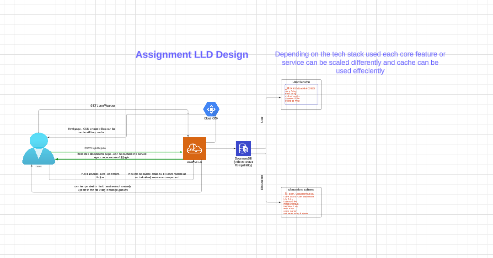

# Social Project

Hi 👋 Spyne.ai Engineer,

I have completed this assignment in Flask and MongoDB.
Well, At my current company, I am heavily working on multiple flask based projects. So, i thought let's build this in flask. Though, I have more experience working with Nodejs as well.

I have covered all the features, if you have some feedback or anything else is left, Please let me know. Iam open to changes or any specific implementation
## Demo of the assignment
### Walkthrough in 2 minutes:
 
 #### Video Link:
 https://drive.google.com/file/d/1wtnt4ibadTZn0TTqHcQU2BhFDNodexuV/view?usp=sharing

## Documentation
https://www.notion.so/Docs-952428ea4a3e4c8daffcf8741d550a6f


## LLD Design
https://lucid.app/lucidchart/4e829459-17d8-473a-81ab-a343ead556c3/edit?viewport_loc=-9909%2C-3177%2C6059%2C2938%2C.Q4MUjXso07N&invitationId=inv_b3763377-3424-4a8a-8e60-21594f0c0a57



## Instructions

### Clone the Project

Run the command:

```bash
git clone https://github.com/Aslam-13/social.git
``` 

Navigate inside the project:
```bash
cd social
```

Create a virtual environment:
```bash
virtualenv myenv (name of environment)
```

Activate the environment:
```bash
./myenv/Scripts/activate
```

Install dependencies:
```bash
pip install -r requirements.txt
```

Set environment variables:

```bash
 FLASK_APP=app.py
 FLASK_ENV=development
```

Run the project:
```bash
flask run
```
Congrats, The project is running locally 🎉🥳🎊

Test out the features. 🙌🏼
